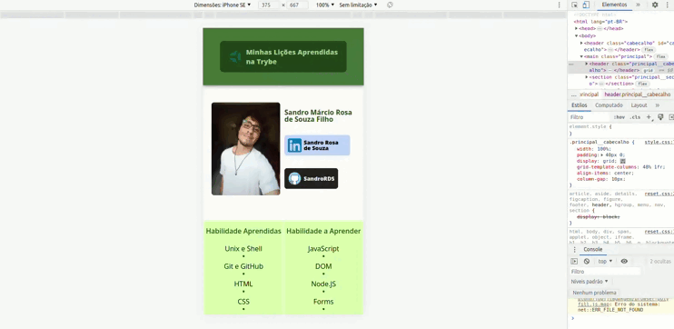

# Módulo 1 - Dia 2.5: Projeto - Lessons Learned

> Data: 27/03/2023

Hoje foi nosso último dia da seção 2 e primeiro dia de projeto aqui na Trybe. No projeto Lessons Learned, tivemos que aplicar na prática todos os conceitos que aprendemos sobre HTML e CSS estruturando a página corretamente, de forma semanticamente coerente, estilizando os elementos e organizando o posicionamento deles na página; Além disso, praticamos conceitos importantes de Git, GitHub e Terminal executando testes unitários locais, abrindo uma Pull Request para o repositório do projeto e fazendo o versionamento correto do código, realizando commit's e push's com frequência.

